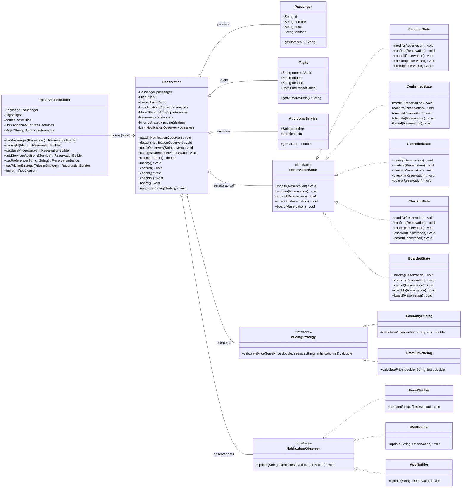

# Ejercicio 6: Sistema de Reservas para Aerolínea - Diagrama de Clases

## Diagrama (Mermaid)

## Descripción de los patrones en el diagrama

- **Builder**: `ReservationBuilder` permite ensamblar `Reservation` paso a paso mediante métodos fluidos (`setPassenger`, `setFlight`, `addService`, `setPreference`, `build`), evitando constructores telescópicos.
- **Strategy**: `Reservation` delega el cálculo del precio en una `PricingStrategy` intercambiable (`EconomyPricing`, `PremiumPricing`), seleccionable en tiempo de ejecución.
- **State**: `Reservation` delega su comportamiento en un `ReservationState` (`PendingState`, `ConfirmedState`, `CancelledState`, `CheckInState`, `BoardedState`). Cada estado define qué transiciones son válidas.
- **Observer**: `Reservation` mantiene una lista de `NotificationObserver` (`EmailNotifier`, `SMSNotifier`, `AppNotifier`) y los notifica ante eventos (confirmación, cancelación, cambios de horario).