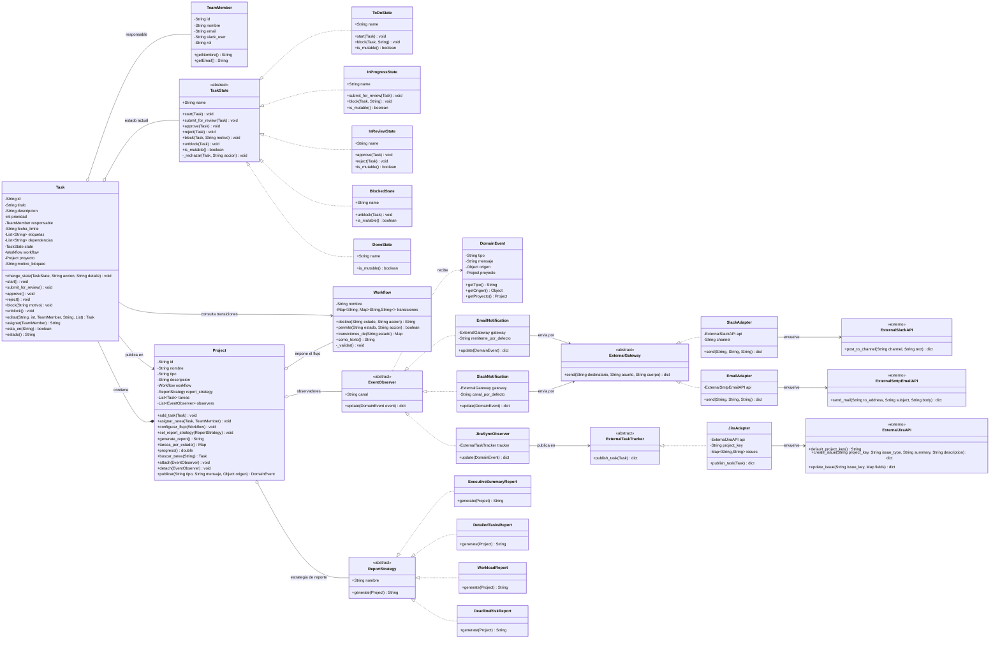

# Ejercicio 8: Plataforma de Gestión de Proyectos - Diagrama de Clases

## Diagrama

## Descripción de los patrones en el diagrama

### State — ciclo de vida de la tarea

`Task` no contiene ningún `if` sobre su estado: delega cada acción en su
`TaskState` actual, y el estado decide. `TaskState` declara las seis acciones
posibles (`start`, `submit_for_review`, `approve`, `reject`, `block`, `unblock`)
y las cinco subclases las implementan todas.

Hay **dos capas** de decisión, y esta separación es lo que hace el flujo
configurable:

- **La subclase de estado** responde *qué acción tiene sentido conceptualmente
  aquí*. Por ejemplo, `ToDoState.start` construye un `InProgressState`; la acción
  de bloquear existe conceptualmente en `ToDo` y por eso delega, en vez de
  rechazarse de entrada.
- **El `Workflow`** responde *si la transición está permitida y hacia dónde va*.
  `Task.change_state` consulta `Workflow.destino(estado_actual, accion)`. Si la
  tabla no declara esa acción, se lanza `InvalidStateTransitionError`; si la
  declara apuntando a un estado distinto del que la subclase construyó, se lanza
  `WorkflowConfigurationError`, que detecta el error de implementación.

Consecuencia: las reglas del enunciado viven en la tabla, no en el código de los
estados. Añadir el estado `OnHold` requiere una subclase nueva y una fila en la
tabla; cambiar el proceso de approvals de un proyecto a otro no requiere ninguna
subclase nueva.

### Workflow — tabla de transiciones configurable

Flujo por defecto:

| Estado | Acciones permitidas | Destino |
| ------ | ------------------- | ------- |
| `ToDo` | `start` | `InProgress` |
| `InProgress` | `submit_for_review` | `InReview` |
| `InProgress` | `block` | `Blocked` |
| `InReview` | `approve` | `Done` |
| `InReview` | `reject` | `InProgress` |
| `Blocked` | `unblock` | `InProgress` |
| `Done` | *(ninguna)* | — |

Las tres reglas del enunciado se leen directamente en la tabla:

- *"Solo las tareas en progreso pueden ser bloqueadas"*: `block` solo existe en la
  fila `InProgress`.
- *"Las tareas completadas no pueden modificarse"*: la fila `Done` está vacía y
  `DoneState.is_mutable()` devuelve `false`, lo que además bloquea `editar` y
  `asignar`.
- *"Solo las tareas en revisión pueden aprobarse"*: `approve` solo existe en la
  fila `InReview`.

`Project.configurar_flujo` reemplaza la tabla y la propaga a las tareas ya
creadas, de modo que el flujo puede reconfigurarse en caliente.

### Observer — notificaciones desacopladas

`Project` es el **sujeto único** de la plataforma: mantiene la lista de
observadores y expone `attach`, `detach` y `publicar`. `Task` no tiene lista
propia; guarda una referencia a su proyecto y le publica los hechos. Así hay una
sola suscripción que mantener, en vez de dos que habría que sincronizar cada vez
que se adjunta un canal.

Un hecho viaja como un `DomainEvent` (`tipo`, `mensaje`, `origen`, `proyecto`) y
no como un string. El `tipo` permite reaccionar sin adivinar por el texto, y el
`origen` da acceso a la entidad real que produjo el hecho, que es lo que
`JiraSyncObserver` necesita para crear el issue.

Los tres observadores cumplen el mismo contrato `update(event)`:

- `EmailNotification` y `SlackNotification` no conocen la API: reciben un
  `ExternalGateway` y solo arman destinatario, asunto y cuerpo desde
  `event.proyecto`.
- `JiraSyncObserver` recibe un `ExternalTaskTracker` y publica `event.origen`
  cuando el tipo del evento es una creación o un cambio de estado.

Agregar un canal (SMS, Teams, panel) es escribir una clase que implemente
`EventObserver` y adjuntarla al proyecto; no se toca `Project`, ni `Task`, ni los
canales existentes.

### Strategy — generación de reportes

`ReportStrategy` declara `generate(Project) String`. El algoritmo recibe el
proyecto completo y decide qué datos leer y cómo presentarlos. `Project` guarda
una estrategia y `set_report_strategy` la reemplaza en tiempo de ejecución, de
modo que el mismo proyecto produce un resumen ejecutivo o un detalle de tareas sin
cambiar una línea de la lógica de negocio.

Un quinto reporte se añade implementando la interfaz, sin modificar `Project` ni
los reportes existentes.

### Adapter — integraciones externas

Dos interfaces uniformes, porque hay dos natureszas de integración distintas:

- `ExternalGateway.send(destinatario, asunto, cuerpo)` para **notificar**. Todo
  canal de la interfaz habla el mismo idioma, aunque las APIs no:
  `ExternalSlackAPI.post_to_channel` recibe un canal y un texto, y
  `ExternalSmtpEmailAPI.send_mail` recibe dirección, asunto y cuerpo con otros
  nombres y otro formato de respuesta. `SlackAdapter` y `EmailAdapter` traducen
  entre ambos mundos.
- `ExternalTaskTracker.publish_task(Task)` para **sincronizar datos**, que no es un
  canal de notificación sino un destino. `JiraAdapter` mapea una `Task` a los
  cuatro campos que espera `ExternalJiraAPI.create_issue`.

Las clases marcadas `<<externo>>` representan APIs de terceros: no se modifican,
no heredan de nada nuestro y no conocen el dominio. Cambiar Slack por Teams, o
Jira por Trello, es escribir un adaptador nuevo.

## Excepciones

| Error | Origen |
| ----- | ------ |
| `InvalidStateTransitionError` | `TaskState._rechazar` y `Workflow.destino` |
| `TaskNotMutableError` | `Task.editar` y `Task.asignar` sobre una tarea en `Done` |
| `WorkflowConfigurationError` | `Workflow._validar` y `Task.change_state` |
| `SlackApiError`, `SmtpDeliveryError`, `JiraApiError` | Solo dentro de las APIs externas; los adaptadores las capturan y reemiten como `RuntimeError` |

## Clases escritas fuera de los paquetes

Dos clases viven en `main.py` a propósito, para demostrar que los cuatro patrones
son extensibles sin modificar lo que ya existe. No aparecen en el diagrama
porque no forman parte de la arquitectura de referencia:

| Clase | Patrón | Qué demuestra |
| ----- | ------ | ------------- |
| `ConsoleAuditObserver` | Observer | Un canal más se agrega con una clase que implemente `EventObserver` y un `attach`. No se tocó `Project`, ni `Task`, ni los tres canales existentes. |
| `ReportStrategyPersonalizado` | Strategy | Un reporte más se agrega implementando `ReportStrategy`. No se tocó `Project` ni los otros cuatro algoritmos. |
